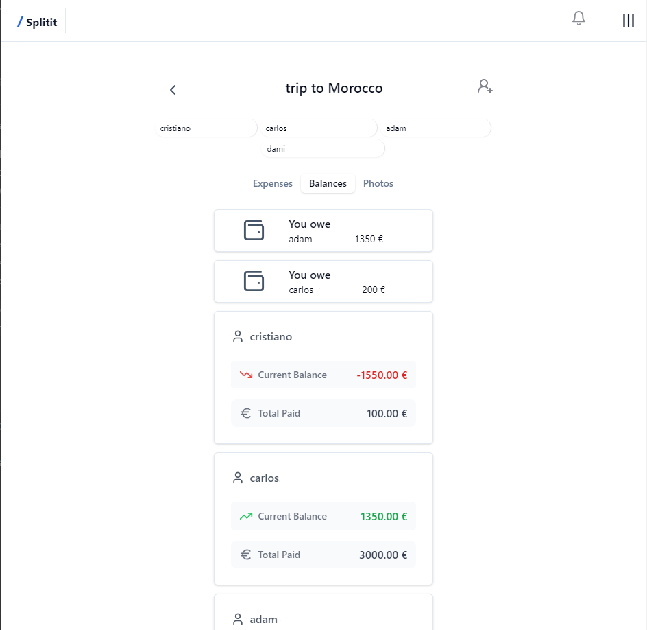

#  Splitit
##  Overview

# Splitit: Split Expenses, Keep Friendships

Say goodbye to awkward money talks and hello to hassle-free shared expenses!

## 🚀 Simplify Your Shared Finances

Splitit is your go-to app for effortlessly managing group expenses. Whether you're planning a dream vacation, sharing a delicious dinner, or splitting household bills, Splitit has got you covered.

## 🧮 Let Splitit Do the Math

No more calculator headaches or confusing spreadsheets. Just add your expenses, and watch Splitit work its magic. Our smart algorithm calculates who owes what, so you don't have to.

## 🤝 Fair Shares, Happy Friends

Keep your friendships strong by ensuring everyone pays their fair share. Splitit makes it easy to track, settle up, and move on to your next adventure together.

## 🎉 Quick Setup, Instant Relief

1. Add your expenses
2. Let Splitit crunch the numbers
3. Settle up with friends
4. Done! Time to plan your next outing!

Don't let money matters come between you and good times. Download Splitit today and experience the joy of stress-free expense sharing!

Happy splitting, happy friends! 🎊💸

*This application was developed as a learning project for Chingu Voyage 51.*

### Preview

## Tech stack

### Front-end

* React with TypeScript

* ViteJS as Build Tool

* CSS Tailwind

### Back-end

* Node.JS with TypeScript

* Express as API framework

* Prisma as ORM

* PostgreSQL as database

* Google Oauth

* Neon Console

## Configuration

* .env samples

## Deployment

* Deployment to Render

## Design

* FIGMA

* Lucidchart for DB prototype

* Lucidspark for User flows

##  Features

1. **Google Authentication**:
* Google Authentication is implemented, allowing users to securely log in using their Google accounts.
* Only authenticated users can access and manage expense groups and data.

2. **Expense Group Management**:
* Each group can have multiple members
* One or more expense groups can be created with a specific budget
* A participant in an expense group can have a particular weighted contribution to the total amount
* **(TODO)** An expense group can be edited and deleted
* **(TODO)** One or more receipt proofs can be consulted 
* A unique link is generated for each group, which can be shared to invite participants.
* Participants can join an expense group via the unique link.
* **(TODO)** Only the group creator has the authority to close an expense group, finalizing all contributions.

3. **Expense Management**:
* Users can add new expenses with all required details
  * Name of expense
  * Description
  * Amount
  * Participant name
  * Date (captured automatically)
  * Category
  * % Contribution
  * Receipt proof
* **(TODO)** Existing expenses can be edited and deleted
* Date of expense is automatically captured
* **(TODO)** The receipt proof of an expense can be consulted
* Users can view a comprehensive history of all expenses.

4. **Calculations**:
* The app accurately calculates balances within the group according to the weighted contribution of some participants
* Calculations update in real-time when expenses change

5. **Summary and Visualization**:
* Users should be provided with a clear summary of total expenses and individual balances.
* **(TODO)** Users can view a chart with the distribution of expenses within a group

6. **Data Persistence**:
* All expense data, including group details, expenses, and receipts, is stored in a secure database.
* **(TODO)** Receipt proofs are stored in the database and remain accessible even after an expense group is closed.

7. **Analytics**:
* **(TODO)** One or more analytics chart are available for consultation

##  Running the project 
### Live site
[Splitit](https://splitit-j0gt.onrender.com/)

### From the repo:
1. Clone this project locally
2. Run `npm install` in your bash/command line both on client and on server folders
3. Run `npm start` in your bash/command line on server folder
4. Run `npm run dev` in your bash/command line on client folder

##  Client Dependencies:

* @hookform/resolvers
* @radix-ui/react
* @tanstack/react-query
* axios
* class-variance-authority
* clsx
* lucide-react
* react
* react-dom
* react-hook-form
* react-router-dom
* tailwind-merge
* tailwindcss-animate
* zod

##  Client DevDependencies

* @eslint/js
* @types/node
* @types/react
* @types/react-dom
* @vitejs/plugin-react
* autoprefixer
* eslint
* eslint-plugin-react-hooks
* eslint-plugin-react-refresh
* globals
* postcss
* tailwindcss
* typescript
* typescript-eslint
* vite

##  Server Dependencies

* @prisma/client
* cors
* dotenv
* express
* jsonwebtoken
* passport
* passport-google-oauth20
* swagger-ui-express
* zod
* zod-openapi

##  Server DevDependencies

* @types/cookie-parser
* @types/cors
* @types/express
* @types/jsonwebtoken
* @types/node
* @types/passport
* @types/passport-google-oauth20
* cookie-parser
* prisma
* ts-node-dev
* tsup
* typescript

## API Documentation

### Authentication Routes

- **login/register**: `GET /api/v1/auth/google`
- **logout**: `GET /api/v1/auth/logout`
- **Refresh Access Token**: `POST /api/v1/auth/refresh-token`

### ExpenseGroup Routes

## Our Team

- Adam Honvedo: [GitHub](https://github.com/Homvi) / [LinkedIn](https://www.linkedin.com/in/adamhonvedo/)
- Cristiano Valente: [GitHub](https://github.com/cris-valente) / [LinkedIn](https://www.linkedin.com/in/cristiano-valente-3943092a1/)
- Damilola Oshinowo: [GitHub](https://github.com/dami-boy) / [LinkedIn](www.linkedin.com/in/damilola-oshinowo)
- Carlos Morais: [GitHub](https://github.com/Morais-C) / [LinkedIn](https://www.linkedin.com/in/carlosmoraisprofile/)
